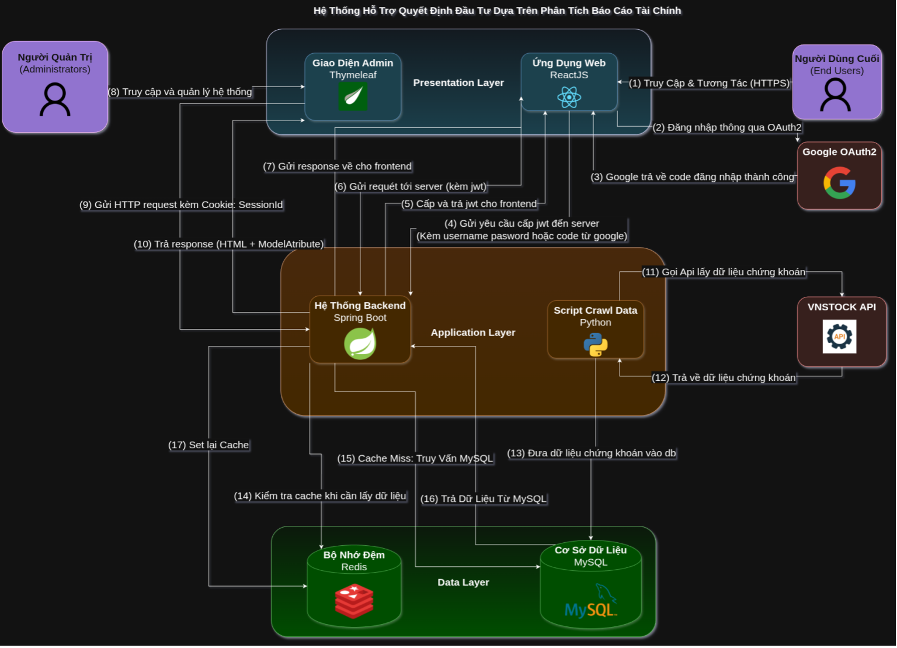

# 💸 FinFlow - Trợ Lý Tài Chính Cá Nhân Toàn Diện  
# 💸 FinFlow - Your All-in-One Personal Finance Assistant



---

## 🌟 Giới thiệu  
## 🌟 Introduction

**Tiếng Việt:**  
FinFlow (viết tắt của *Financial Flow - Dòng Chảy Tài Chính*) là một ứng dụng quản lý tài chính cá nhân hiện đại, giúp người dùng theo dõi chi tiêu, quản lý đầu tư, lập kế hoạch tài chính, và nhận được tư vấn thông minh từ AI. Ứng dụng tập trung vào **tính cá nhân hóa**, **trực quan**, và **phân tích sâu** nhằm nâng cao khả năng kiểm soát tài chính của người dùng.

**English:**  
FinFlow (short for *Financial Flow*) is a modern personal finance management application that helps users track expenses, manage investments, create budgets, and receive intelligent recommendations powered by AI. It focuses on **personalization**, **intuitive design**, and **deep analysis** to improve financial decision-making.

---

## ✨ Tính năng chính  
## ✨ Key Features

- 💰 **Quản lý Giao dịch Toàn diện** / **Comprehensive Transaction Management**  
  Ghi chép thu chi, phân loại giao dịch, gợi ý nhóm giao dịch.  
  Track income & expenses, auto-categorize transactions, suggest groupings.

- 📊 **Phân tích & Quản lý Đầu tư** / **Investment Tracking & Analysis**  
  Tích hợp dữ liệu thị trường, phân tích lợi nhuận, gợi ý tối ưu hóa danh mục.  
  Real-time stock integration, return analysis, portfolio optimization tips.

- 📅 **Lập Kế hoạch Ngân sách** / **Budget Planning**  
  Đặt hạn mức chi tiêu theo danh mục và theo dõi tiến độ hằng tháng.  
  Set budget goals by category and monitor monthly progress.

- 🔔 **Thông báo Tài chính** / **Smart Notifications**  
  Nhắc nhở hóa đơn, cảnh báo vượt ngân sách, gợi ý tiết kiệm.  
  Bill reminders, overspending alerts, smart saving suggestions.

- 🤖 **Trợ lý Tài chính AI** / **AI Financial Assistant**  
  Dự đoán xu hướng chi tiêu, đưa ra khuyến nghị thông minh.  
  Predict future spending, suggest financial tips via AI.

- 📈 **Biểu đồ & Báo cáo Trực quan** / **Charts & Visual Reports**  
  Trực quan hóa tài chính với biểu đồ, báo cáo động theo thời gian.  
  Interactive charts and dashboards for your financial data.

---

## 🧰 Công nghệ sử dụng  
## 🧰 Technology Stack

### 🖥️ Backend (Java - Spring Boot MVC)

| Tiếng Việt                     | English                           |
|-------------------------------|------------------------------------|
| Spring MVC                    | Spring MVC Web Framework           |
| Spring Security + OAuth2      | Spring Security + OAuth2 Client    |
| Spring Data JPA               | Spring Data JPA                    |
| JWT xác thực                  | JWT Authentication                 |
| Thymeleaf (cho Admin)         | Thymeleaf (for Admin Interface)    |
| Apache Tomcat                 | Embedded Web Server                |
| Maven                         | Build Tool                         |

### 💻 Frontend (ReactJS)

| Tiếng Việt     | English               |
|----------------|------------------------|
| ReactJS        | ReactJS Framework      |
| Redux          | State Management       |
| Axios          | HTTP Client            |
| Chart.js       | Data Visualization     |

### 🧠 Microservice AI (Python)

| Tiếng Việt                  | English                          |
|----------------------------|-----------------------------------|
| Flask / FastAPI            | Python Web Framework              |
| vnstock                    | Vietnam Stock Market API          |
| Pandas, NumPy              | Data Analysis Libraries           |
| Scikit-learn               | Machine Learning Toolkit          |

---

## 🚀 Hướng dẫn khởi chạy  
## 🚀 Getting Started

### ⚙️ Backend

```bash
cd backend
./mvnw spring-boot:run
```

### 💻 Frontend

```bash
cd frontend
npm install
npm start
```

### 🧠 AI Microservices

```bash
cd ai-services/transaction-classifier
python app.py
```

---

## 📃 Giấy phép  
## 📃 License

FinFlow được phát triển cho mục đích học tập và nghiên cứu cá nhân.  
FinFlow is developed for educational and personal research purposes.

---

## 📫 Liên hệ / Contact

- Developer: **Nguyễn Văn Bảo**
- Email: `bao19042004@gmail.com`

---
